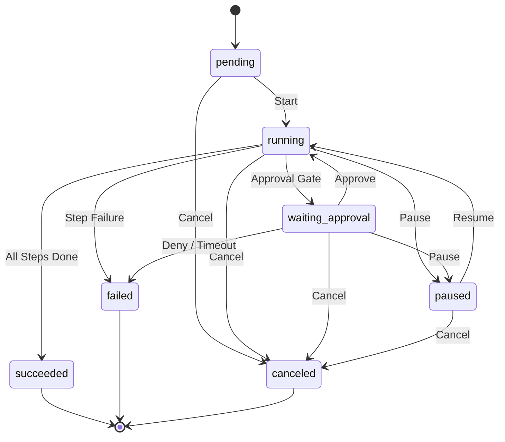

# Runtime State Machine

The Cogito runtime is built around a deterministic state machine that manages the lifecycle of workflow runs and individual steps. It ensures consistent execution, supports manual and automated approval gates, and provides event-driven replay for recovery.

## Overview

The execution engine (`internal/runtime/Engine`) maintains a `Snapshot` of the current state, which is updated by applying a sequence of events. This architecture allows for:

- **Deterministic Scheduling**: Steps are selected for execution based on a strict topological order defined by the workflow graph.
- **State Integrity**: All state transitions are validated against predefined allow-lists for both runs and steps.
- **Resilience**: The state can be completely reconstructed from an event log, enabling recovery from process failures.

## Run States

A workflow run follows a lifecycle from creation to a terminal state.

### Run Lifecycle Diagram



### State Descriptions

| State | Description |
| :--- | :--- |
| `pending` | The run has been created but has not yet started execution. |
| `running` | The engine is actively scheduling and executing steps. |
| `waiting_approval` | Execution is suspended until an external approval decision is provided. |
| `paused` | The run has been manually suspended. |
| `succeeded` | Terminal state: All steps in the workflow have completed successfully. |
| `failed` | Terminal state: One or more steps failed, or the run was denied approval. |
| `canceled` | Terminal state: The run was manually terminated before completion. |

## Step States

Each step in the workflow progresses through its own state machine. Steps are managed by the engine in the context of the overall run.

### Step Transition Table

| From State | To State | Trigger |
| :--- | :--- | :--- |
| `pending` | `queued` | Dependencies met, step ready for execution. |
| `pending` | `canceled` | Run canceled. |
| `queued` | `running` | Step picked up by the execution driver. |
| `queued` | `canceled` | Run canceled. |
| `running` | `waiting_approval` | Step requires explicit or adapter-driven approval. |
| `running` | `queued` | Step interrupted and marked for retry. |
| `running` | `succeeded` | Execution completed successfully. |
| `running` | `failed` | Execution failed. |
| `running` | `canceled` | Run canceled. |
| `waiting_approval` | `running` | Approval granted, step resumes. |
| `waiting_approval` | `queued` | Step interrupted and marked for retry. |
| `waiting_approval` | `succeeded` | Approval granted (for manual approval steps). |
| `waiting_approval` | `failed` | Approval denied or timed out. |
| `waiting_approval` | `canceled` | Run canceled. |

## Scheduling

Cogito uses a deterministic scheduling strategy to select the next steps for execution.

### Topological Order
The workflow graph is compiled into a topological order. The engine iterates through this order to ensure that dependencies are respected. A step is only moved from `pending` to `queued` when all steps listed in its `needs` field have achieved the `succeeded` state.

```go
func (e *Engine) selectReadyPendingStepIDs() []string {
	ready := make([]string, 0)
	for _, stepID := range e.compiled.TopologicalOrder {
		stepSnapshot := e.snapshot.Steps[stepID]
		if stepSnapshot.State != StepStatePending {
			continue
		}

		step := e.compiled.Steps[e.compiled.StepIndex[stepID]]
		dependenciesReady := true
		for _, dependencyID := range step.Needs {
			if e.snapshot.Steps[dependencyID].State != StepStateSucceeded {
				dependenciesReady = false
				break
			}
		}

		if dependenciesReady {
			ready = append(ready, stepID)
		}
	}
	return ready
}
```

### Deterministic Selection
While multiple steps might be ready at the same time, the engine currently processes them one by one according to their position in the `TopologicalOrder`. This ensures that the execution sequence is predictable and repeatable across replays.

## Approval Integration

Approval gates can be triggered in three ways:

1. **Explicit**: An `approval` kind step is defined in the workflow YAML.
2. **Adapter**: A step adapter (e.g., a deployment agent) signals that it requires external authorization during execution.
3. **Policy**: An automated `ApprovalPolicy` determines that a step requires manual intervention based on the current context or metadata.

### Approval Decisions

When a run enters `waiting_approval`, it remains there until a decision is recorded via `GrantApproval`, `DenyApproval`, or `TimeoutApproval`.

```go
type ApprovalDecision string

const (
	ApprovalDecisionWait    ApprovalDecision = "wait"
	ApprovalDecisionApprove ApprovalDecision = "approve"
	ApprovalDecisionDeny    ApprovalDecision = "deny"
	ApprovalDecisionTimeout ApprovalDecision = "timeout"
)
```

- **Approve**: Resumes execution. If it was an `approval` step, it marks it as `succeeded`. If it was an adapter-driven gate, the engine calls `Resume` on the adapter.
- **Deny / Timeout**: Transitions the step and the run to the `failed` state.

## Replay

The `Replay` mechanism is the source of truth for the runtime state. Instead of relying on a mutable database record, Cogito reconstructs the `Snapshot` by playing back events from the `EventStore`.

```go
func Replay(runID string, compiled *workflow.CompiledWorkflow, events []store.Event) (*ReplayResult, error) {
	snapshot := newZeroSnapshot(runID)
	transitions := make([]Transition, 0, len(events))
	for _, event := range events {
		if err := applyEvent(compiled, &snapshot, &transitions, event, ErrorCodeReplay); err != nil {
			return nil, err
		}
	}
	return &ReplayResult{
		Snapshot:    snapshot,
		Transitions: transitions,
	}, nil
}
```

### Validation during Replay
During replay, every event is validated:
- **Sequence**: Events must have strictly increasing, contiguous sequence numbers.
- **Transitions**: Every state change must be valid according to the `allowedRunTransitions` and `allowedStepTransitions` maps.
- **Context**: Step IDs and Run IDs in events must match the compiled workflow and the current run context.

This strict validation ensures that the state machine cannot reach an inconsistent state, even if the event log is corrupted or manually tampered with.
